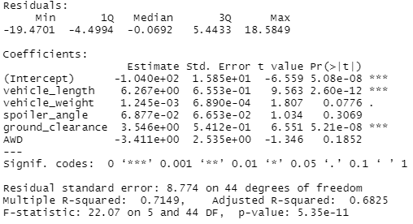
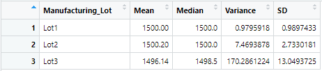
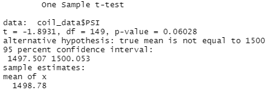
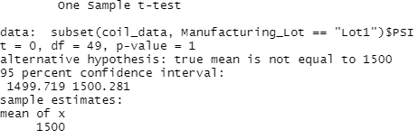
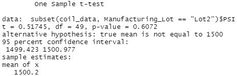
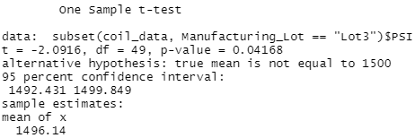

# MechaCar_Statistical_Analysis

## Linear Regression to Predict MPG
Linear Regression Results:

* Which variables/coefficients provided a non-random amount of variance to the mpg values in the dataset?

Vehicle length and ground clearance provided a non-random amount of variance. This implies a significant linear relationship between these variables and miles per gallon.

* Is the slope of the linear model considered to be zero? Why or why not?

The slope is non-zero. The null hypothesis is that the slope is equal to 0 and has been rejected on a 95% confidence interval. This can be seen in the p-value of 5.35e-11 which is far less than 0.05.

* Does this linear model predict mpg of MechaCar prototypes effectively? Why or why not?

This linear model predicts the mpg fairly effectively. This can be seen by the high R-squared value of approximately 0.71.

## Summary Statistics on Suspension Coils

* The design specifications for the MechaCar suspension coils dictate that the variance of the suspension coils must not exceed 100 pounds per square inch. Does the current manufacturing data meet this design specification for all 
manufacturing lots in total and each lot individually? Why or why not?

Total Summary Results:

Overall the lots have a variance of roughly 62.3, which is lower than the 100 PSI variance required. The mean and median are very close at roughly 1499 and 1500 PSI respectively making it likely that this is the intended design PSI.

Lot Summary Results:

Individually, Lot 1 and Lot 2 meet the requirement of being below 100 PSI of variance, and are providing near perfect results (both values are below 10). Lot 3 fails the requirement for less than 100 PSI of variance at slightly above 170
PSI. Lot 3 skewed the results in the total summary to have a lower mean, and have a significantly higher variance and standard deviation.

## T-Tests on Suspension Coils

T-tests are appropriate to determine the quality of manufacturing for the suspension coils, because the goal is to produce coils with suspension pressure of 1500 PSI as consistently as possible with little variation. The t-test helps 
determine whether the mean suspension pressure of a data set is equal to 1500 PSI.

T-test All Lots Summary Results:

In the results of this t-test, the null hypothesis is that the true mean is equal to 1500 PSI. This has failed to be rejected on a 95% confidence interval as the p-value is 0.06 which is greater than 0.05. 

T-test Lot 1 Summary Results:

In the results of this t-test, the null hypothesis is that the true mean is equal to 1500 PSI. This has failed to be rejected on a 95% confidence interval definitively as the p-value was 1. 

T-test Lot 2 Summary Results:

In the results of this t-test, the null hypothesis is that the true mean is equal to 1500 PSI. This has failed to be rejected on a 95% confidence interval with a fairly large p-value of 0.6. 

T-test Lot 3 Summary Results:

In the results of this t-test, the null hypothesis is that the true mean is equal to 1500 PSI. This has been rejected on a 95% confidence interval with a p-value of 0.04.

The results from these t-tests are in alignment with the findings in the total and lot summary statistics. The t-test on all the lots combined proved to be acceptable for manufacturing standards, but upon further investigation lot 3 is 
the only lot that does not comply with manufacturing standards, while lots 1 and 2 easily comply. If the manufacturing was improved in lot 3 it is clear that the overall dataset would be able to fail to reject the null hypothesis at a 
significantly higher confidence interval.  

## Study Design: MechaCar vs Competition

In an effort to determine what metrics are important to the consumer I would come up with a comprehensive list of metrics such as cost, safety rating, time to get from 0-60, fuel efficiency, maintenance cost, horsepower, etc. and I would
use multiple linear regression on a previous year's data of all car models of a specific type and map these features to sales. The hypothesis for multiple linear regression is that the slope of the linear model is not 0. This implies 
correlation between the metrics selected and sales. The null hypothesis is that the slope of the linear model is 0 implying the opposite. The alternative hypothesis is the same as the hypothesis. Then I would determine which metrics 
have a significant linear relationship to sales (based on the p-value) as this would determine metrics that have a significant correlation to sales implying which features the customer truly values.  After refining the metrics, I would 
run a second multivariate linear analysis with just the statistically relevant metrics (the hypothesis, null hypothesis, and the alternative hypothesis remain the same). I would then use the coefficients found in this process to create a 
linear equation to predict next year's sales numbers based on the metrics of all the cars in the category for this year. 

